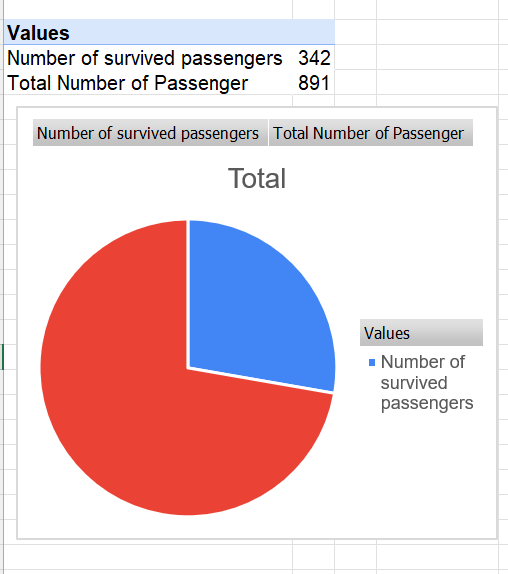
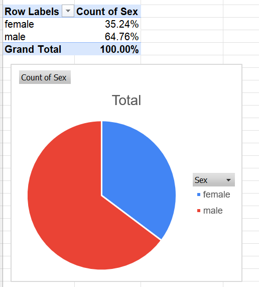
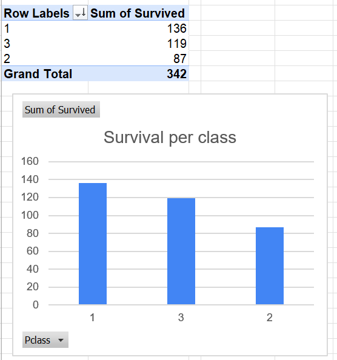

Disclaimer: The dataset is from https://github.com/rohanmistry231/Practice-Datasets-for-Excel

**Questions (first > will be SQL's answer, second > will be Excel's answer):**

•	What is the survival rate of the passengers?
> I calculated the total number of survivors and then use the AVG function (where the sum of suitable case will be divided with total number of rows)

> I used Pivot Table with the value as sum of survived and use count survived to get the total to use the pie chart

•	What is the average age of the passengers?
> I calculated the average like normal, but minus the rows without age column

> I created Pivot Table and use age in Value field and set it into Average. No need for chart here. But I would use Historgram if I also calculate median and mean ages

•	What is the proportion of male and female passengers?
> At first I COUNT the total of male and female then AVG to get the proportions. I also included subquery, but it was not optimized. So I just GROUP BY sex to get 2 groups of male and female, then COUNT the number inside that group and divide with SUM of both gender (OVER()). Note: * 100 must be done for top part

> I used Pivot Table, put sex in Rows to show both sexes, and use Count Sex in Value field. I used Pie Chart to represent the percentage

•	Which class of passengers had the highest survival rate?
> I GROUP BY pclass to divide the data into 3 groups, then use AVG function to find survival rate. Then sort the survival rate in decending order and only print 1 (LIMIT 1)

> I created Pivot Chart and put pclass in Rows, Sum number of survivors in Value based on their class. Then I used Column Chart to represent the number of survivors

•	What is the distribution of the fare paid by the passengers?
> I use CASE to create fare range, then COUNT the number of passengers in each range and order in decending order.

> I created Pivot Chart. Then put Fare (price) in Rows. Then I **group** the value based on the distribution of ticket prices (step: 25). After that I just but Fare in Value and count the total number of it. I want to use Historgram to show up how many tickets were sold, and how much did them make as total. However, I have to copy to a second table because Historgram won't work on Pivot Tables

**Tools:**
1. SQL - SQLite for beginner
2. Excel
3. Github for version control
(Maybe in future, using Python and R)

**Lessons (SQL):**
- Port the data from .xlsx to .csv first to use it
- Install sqlite3 and call it a day
- use queries.sql to store the queries / Update: not very professional for reporting, just use different query file for each requirement
- Can run in VSCode (still use PowerShell terminal). Run .read sql/queries.sql to run the file
- Used header and mode to show the first column 
- Do not count again if use AVG
- Utilize SELECT column and GROUP BY *column*

**Lessons (Excel):**
- I refrain from using formulas in Excel because I want to practice Pivot Table. So far so good. Somes are not needed to use Pivot table (survived rate, age), but it is a good practice
- Have to practice more with charts instead of just using only pie and column charts.

